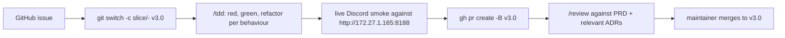

# Agent playbook for DisComfy v3.0

This file is the contract for any AI agent (Cursor Cloud agent, local
Cursor agent, Claude Code, Codex CLI, etc.) picking up a slice issue
from milestone [v3.0.0](https://github.com/jmpijll/discomfy/milestone/1).

**Branch model:** all v3 work happens off the long-lived `v3.0` branch.
`main` stays on v2.1.x until the parity audit (Slice 10).

## Read this first, in this order

1. [`CONTEXT.md`](./CONTEXT.md) - ubiquitous language. Use these terms
   verbatim in commit messages and PRs (Workflow / Manifest / Modality /
   Slot / NodeMap / Run / Output / Action / Plugin / Pack / Author / Setup).
2. [`docs/v3/PRD.md`](./docs/v3/PRD.md) - what we are building and why.
3. [`docs/v3/adr/`](./docs/v3/adr/) - the seven accepted ADRs anchoring
   the architecture. Do not re-litigate decisions; supersede an ADR with
   a new one if you must reverse course.
4. [`docs/v3/discovery.md`](./docs/v3/discovery.md) +
   [`docs/v3/workflows-static.md`](./docs/v3/workflows-static.md) +
   [`docs/v3/scope.md`](./docs/v3/scope.md) - the live ComfyUI inventory
   you must build against.
5. The slice issue itself - `gh issue view <N> -R jmpijll/discomfy`.

## Workflow

### Step-by-step

1. **Pick an unblocked `ready-for-agent` issue.** Check the "Blocked by"
   section; only start when listed blockers are merged.
2. `git fetch && git switch -c slice/<N>-<short-slug> origin/v3.0`.
3. **Apply `/tdd`.** Each acceptance-criterion checkbox is one
   red-green-refactor cycle. Do not write production code without a
   failing test first. Prior art lives in
   [`tests/`](./tests/) - mirror the existing pytest + asyncio + mock
   conventions.
4. **Use the project's seams.** Test at the highest seam that doesn't
   need a live ComfyUI:
   - manifest loader: YAML in -> Manifest dataclass out
   - `apply_slots` pure function
   - capability inventory parsing (stub `/object_info` JSON)
   - Plugin renderer (synthetic Run -> DiscordPayload)
   - progress mapper (synthetic WS event stream -> percentages)
5. **Write a live smoke** at the end of the slice. The integration test
   is gated by `DISCOMFY_INTEGRATION=1` env var so CI stays fast. Run it
   manually against the user's ComfyUI before opening the PR. Capture a
   Discord screenshot or video and a ComfyUI `prompt_id` in the PR body.
6. **Commit messages**: imperative mood, reference the issue
   (`feat(v3): manifest applier + image_t2i Plugin (#3)`), use
   `CONTEXT.md` terms.
7. **Open the PR with base `v3.0`** (NOT `main`). Title format:
   `Slice <N>: <one-line description>`. Body must include:
   - Closes #<N>
   - List of acceptance criteria with checkmarks
   - Live smoke evidence (Discord URL + ComfyUI prompt_id)
   - Anchors: PRD section + ADR ids touched
8. **Run `/review`** on your own PR before requesting human review:
   - Does every acceptance criterion have evidence?
   - Does any new code branch on a model name? If yes, refactor.
   - Does the diff add anything that's not declared in an ADR? If yes,
     write a new ADR or remove the addition.
9. **`/handoff` if the slice spans sessions.** Save to `$TMPDIR` per the
   skill convention; reference paths to `CONTEXT.md`, the PRD, and the
   issue rather than re-stating their content. Commit nothing to the
   workspace from `/handoff`.

## Hard rules

- Never edit ADRs in place once accepted. Supersede with a new ADR.
- Never add `model_type`-style switch statements. The PRD success
  criteria explicitly forbid them (`grep -E 'model_type|DyPE|hidream|krea'`
  must return zero matches in code by Slice 10).
- Never re-introduce the v1.4.0 backward-compatibility paths. ADR-0006
  is the contract.
- Never bypass the manifest schema. If a workflow needs a thing the
  schema can't express, propose a schema-version bump in the slice.
- Never skip the live smoke. ComfyUI is at
  `http://172.27.1.165:8188` (override via `COMFYUI_URL`). v3 is
  ungrounded without smoke evidence per slice.

## Suggested skills (in order of typical use)

- `/grill-with-docs` - if you discover a domain term that needs to be
  added to `CONTEXT.md`. Don't add silently; the glossary is a contract.
- `/tdd` - drive every acceptance criterion red-green-refactor.
- `/diagnose` - when a smoke fails or a test goes flaky.
- `/handoff` - if you can't finish in one session.
- `/review` - on your own PR before requesting human review, and on any
  PR you're reviewing.
- `/zoom-out` - if you find yourself fighting the architecture, stop
  and re-read PRD + relevant ADR.

## Discovery utilities

- `python scripts/discover_comfyui.py [--url ...]` - regenerate
  `docs/v3/discovery.md`. Useful when the user installs new models.
- `python scripts/analyze_workflows.py` - regenerate
  `docs/v3/workflows-static.md`. Useful when authoring a new manifest
  to confirm node IDs.

Both scripts are kept in-tree as ops utilities, not throwaway prototypes.
