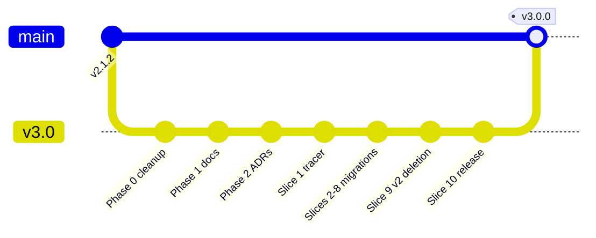

# ADR-0006: v3.0 is a clean break with a one-shot migration script

**Status:** accepted (v3.0 design phase, 2026-06-01)

## Context

v2.x advertises "100% backward compatibility with v1.4.0" in
`CLAUDE.md`. That guarantee is the reason `bot.py` (legacy entry point),
`config.py` (parallel to `config/`), the `import bot as old_bot_module`
fallback in `main.py`, and the `model_type` magic strings all still
exist. They have been quietly broken for months (no `bot.py` file
actually exists; the fallback would `ImportError` at runtime).

Holding to "100% back-compat" while building a manifest-driven
architecture is impossible without keeping a parallel v2 code path
forever - which defeats the point.

## Decision

v3.0 is a clean break. The contract:

1. **`main` stays on v2.1.x** until v3.0 is parity-tested. Users on v2.x
   continue to work.
2. **All v3 work happens on the long-lived `v3.0` branch.** Cleanup
   commits that benefit v2 (requirements pruning, .gitignore fixes) land
   on `main` first.
3. **There is no in-process fallback.** v3 boots from a manifest registry
   or it doesn't boot. No `try: new_path; except: legacy_path`.
4. **Migration is a script, not a runtime path.** When v3.0 ships,
   `scripts/migrate_v2_to_v3_config.py` reads the user's v2 `config.json`
   plus `workflows/*.json` and emits:
   - A new `config.json` with the v3 schema (ADR-0005).
   - One manifest YAML per v2 workflow entry whose underlying model is
     still installed.
   - A `MIGRATION-REPORT.md` listing entries that were dropped because
     their model/LoRA/CLIP files are missing, with reasons.
5. **Old workflow JSONs that no longer run are deleted in Slice 9, not
   ported.** The discovery phase (`docs/v3/scope.md`) confirmed only
   `qwen_image_2512_lora.json` actually runs against the current
   inventory; the others are archaeology.

### Cutover

### What "clean break" does NOT mean

- **No data loss.** v2 `output/` directory contents survive.
- **No silent breakage.** Users running `python bot.py` on v3.0 get a
  clear "v3 entry point is `python main.py`" error.
- **No model re-downloads.** If the migration script can find the model
  in `/object_info`, the manifest references it; users do not re-fetch.

## Consequences

- The "v2.0 maintains 100% backward compatibility with v1.4.0" line in
  `CLAUDE.md` and `README.md` is removed in Slice 9.
- All `try: new; except ImportError: legacy` blocks are deleted - the
  one in `main.py` is gone (Phase 0d).
- The migration script is a one-time deliverable; it doesn't have to be
  pretty, but it has to be correct (Slice 9 includes a smoke test that
  applies it to the user's actual v2.1.2 config and inspects the output).

## Rejected alternatives

- **Maintain both v2 code paths and v3 code paths in parallel** - what
  v2.x does today. The reason this redesign exists.
- **Feature flag (`--v3`) shipping in v2.x first, flip default later** -
  doubles maintenance cost during the redesign. The clean-branch model
  (`v3.0` long-lived branch) gives the same isolation without dual
  paths in one binary.
- **Greenfield repository** - rejected at plan-mode by user. Carries
  more friction (issues, history, deploy targets) than the redesign
  requires.
